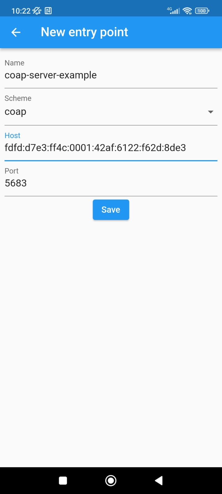
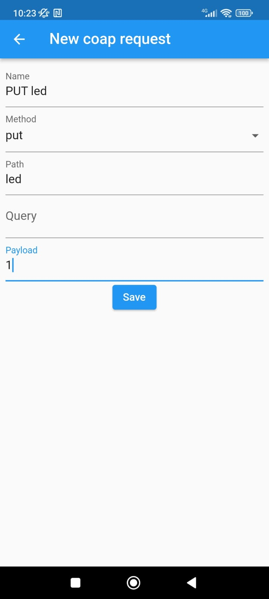
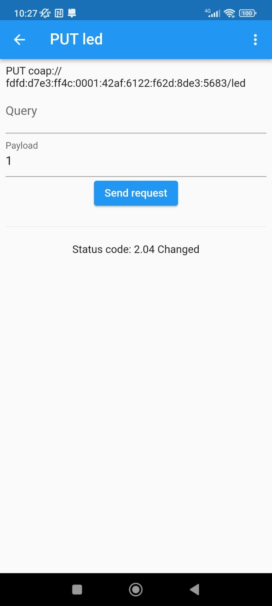
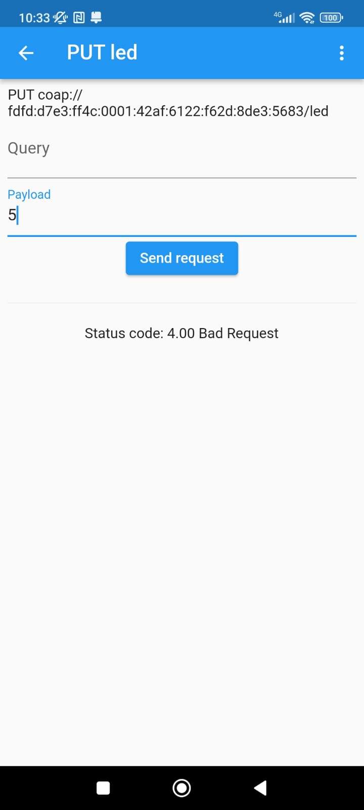
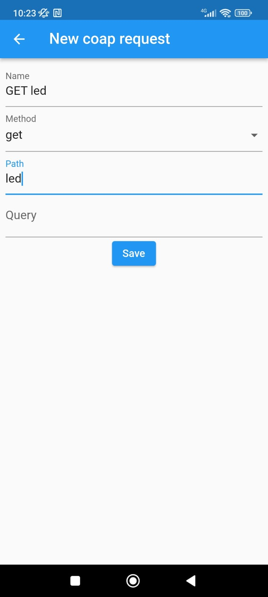

# Aula 3 - Exercício 2: Comunicação externa usando CoAP API e Border Router

## Baixe e abra o seguinte projeto base no VS code para este exemplo
[coap-server-example](/aula-3/coap-server-example/)

1. Na etapa de build adicione o `usb_nrf52840dongle_nrf52840.conf` e `usb_nrf52840dongle_nrf52840.overlay`

# Criando um CoAP Server
O objetivo do exercio é criar um CoAP Server com os recursos de controlar e consultar estados dos LEDs

Referência [Openthread CoAP API](https://openthread.io/reference/group/api-coap?hl=pt-br)

## Configurando a API CoAP Server para receber requisições PUT 
Está etapa tem por objetivo controlar o LED 1, ligar e desligar, através de requisições CoAP PUT, sendo o payload '0' ou '1' para desligar e ligar o LED, respectivamente. **Posto isso, todo processo de configuração do LED deve ser feita como no exercício 2 da aula 2.**

1. Adicione as seguintes configurações no `prj.conf` para habilitar o CoAP API
    ```conf
    CONFIG_OPENTHREAD_COAP=y
    ```
1. Adicione o include do CoAP API
    ```C
    #include <openthread/coap.h>
    ```
1. Adicione as seguinte variáveis **global** e declarações de função ao arquivo `main.c`
    ```C
    //coap buffer
    #define BUFFER_SIZE 50
    char myText[BUFFER_SIZE];
    uint16_t myTextLength = 0;

    //led state
    int ledState = 1;

    //defining request handle and response sender
    static void ledRequestCb(void *pContext, otMessage *pMessage, const otMessageInfo *pMessageInfo);
    static void sendResponse(otMessage *pMessage, const otMessageInfo *pMessageInfo, otCoapCode code, char *payload);
    ```

1. Adicione a váriavel **global** do CoAP resource com o URI "led" ao arquivo `main.c`. Esse será o recurso do LED, tanto para controlar o estado quanto para buscar o estado.
    ```C
    //defining LED coap resourece
    static otCoapResource ledResource = {
        .mUriPath = "led", //path of the resource
        .mHandler = ledRequestCb, //callback function to handle requests
        .mContext = NULL,
        .mNext = NULL
    };
    ```

1. Adicione a seguinte função de enviar respostar ao cliente ao arquivo `main.c`

    Note que não função é possivel adicionar o código de retorno e o payload
    Os códigos CoAP e suas descrições podem ser encontrados [aqui](https://infocenter.nordicsemi.com/index.jsp?topic=%2Fcom.nordic.infocenter.threadsdk.v0.10.0%2Fgroup__api-coap.html&anchor=ga9aa05cbbcfa6954cb13e4745b8cec424)
    ```C
    static void sendResponse(otMessage *pMessage, const otMessageInfo *pMessageInfo, otCoapCode code, char *payload){
        otError error;
        // reponse message variable
        otMessage *pResponse;
        // getting openthread instance 
        otInstance *pInstance = openthread_get_default_instance();

        // creating CoAP new message
        pResponse = otCoapNewMessage(pInstance, NULL);
        if(pResponse == NULL)
        {
            printk("Failed to allocate message for CoAP Response\n");
        }

        // initializing a CoAP new message
        error = otCoapMessageInitResponse(pResponse,
            pMessage,
            OT_COAP_TYPE_ACKNOWLEDGMENT,
            code // response code like 'bad request', 'content' and etc
        );
        if (error != OT_ERROR_NONE){
            printk("otCoapMessageInitResponse error: %d\n", error);
            return;
        }

        //adding a payload
        if(payload != NULL){
            error = otCoapMessageSetPayloadMarker(pResponse);
            if (error != OT_ERROR_NONE) {
                printk("otCoapMessageSetPayloadMarker error: %d\n", error);
                return;
            }
            int payloadSize = strlen(payload);
            error = otMessageAppend(pResponse, payload, payloadSize);
            if (error != OT_ERROR_NONE) {
                printk("otMessageAppend error: %d\n", error);
                return;
            }

        }
        
        // sending the CoAP response
        error = otCoapSendResponse(pInstance, pResponse, pMessageInfo);
        if (error != OT_ERROR_NONE){
            printk("otCoapSendResponse error: %d\n", error);
            otMessageFree(pResponse);
            return;
        }
    }
    ```

1. Adicione a seguinte função de callback para tratar as requisições PUT ao arquivo `main.c`
    ```C
    static void ledRequestCb(void *pContext, otMessage *pMessage, const otMessageInfo *pMessageInfo)
    {	
        // getting coap code/method of the request
        otCoapCode messageCode = otCoapMessageGetCode(pMessage);
        // gatting coap type of the request
        otCoapType messageType = otCoapMessageGetType(pMessage);

        if(messageType != OT_COAP_TYPE_CONFIRMABLE && messageType != OT_COAP_TYPE_NON_CONFIRMABLE ) 
        {
            // sending bad request response back to the client
            sendResponse(pMessage, pMessageInfo, OT_COAP_CODE_BAD_REQUEST, NULL);	
            printk("type %d is not supported\n", messageType);
            return;
        }

        // checking fo PUT requests
        if(messageCode == OT_COAP_CODE_PUT) 
        {	
            // reading the payload message
            myTextLength = otMessageRead(pMessage, otMessageGetOffset(pMessage), myText, BUFFER_SIZE - 1);

            myText[myTextLength] = '\0';
            
            printk("Processing PUT request path=\"led\" and payload=|%s|\n", myText);

            //checking for LED commands
            if(strcmp(myText, "1") == 0){
                // Turning on the LED
                printk("Turning on LED1\n");
                gpio_pin_set_dt(&led, 1);
                ledState = 1;
            }else if(strcmp(myText, "0") == 0){
                // Turning off the LED
                printk("Turning off LED1\n");
                gpio_pin_set_dt(&led, 0);
                ledState = 0;
            }else{
                // sending response with BAD_REQUEST code to the cliente
                printk("payload should be 1 or 0\n");
                sendResponse(pMessage, pMessageInfo, OT_COAP_CODE_BAD_REQUEST, NULL);
                return;
            }

            if(messageType == OT_COAP_TYPE_CONFIRMABLE) 
            {
                // sending response with CHANGED code to the cliente
                sendResponse(pMessage, pMessageInfo, OT_COAP_CODE_CHANGED, NULL);	
            }
        }else{ // in case the method is not allowed
            // sending method not allowed response back to the client
            sendResponse(pMessage, pMessageInfo, OT_COAP_CODE_METHOD_NOT_ALLOWED, NULL);	
            printk("method code %d is not allowed\n", messageCode);
            return;
        }
    }
    ```


1. Adicione a seguinte função de inicialização ao arquivo `main.c`
    ```C
    void coapInit()
    {
        otError error;
        // getting openthread instance 
        otInstance *pInstance = openthread_get_default_instance();

        // setting the openthread instance to led CoAP resource
        ledResource.mContext = pInstance;

        // starting CoAP
        error = otCoapStart(pInstance, OT_DEFAULT_COAP_PORT);
        if (error != OT_ERROR_NONE){
            printk("otCoapStart error: %d\n", error);
            return;
        }

        // adding CoAP resouce
        otCoapAddResource(pInstance, &ledResource);

        printk("CoAP Initialized on Port = %d \n", OT_DEFAULT_COAP_PORT);
    }
    ```

1. Chame a função `coapInit()` no final da função `main()`
    ```C
        void main(){
            //other codes
            coapInit();
        }
    ```
## Configurando a CoAP Client para enviar requisições PUT
### Via Android
 1. Baixe o seguinte APP
 
    [CoAP Client](https://play.google.com/store/apps/details?id=fr.dodecanom.coap_client&hl=en&gl=US)
 
 1. Configure um novo entry point, adicionando no Host o IPv6 da sua placa thread (SLAAC). Para descobrir o IPv6 da placa Thread, basta precionar o botão para que a placa envie as informações ao terminal.
    ```bash
    [00:13:53.275,329] <inf> print_ips: (1) IPv6 Address origin = OT_ADDRESS_ORIGIN_SLAAC, valid = 1: fdfd:d7e3:ff4c:0001:5aa9:6b03:8099:b4ed

    [00:13:53.275,543] <inf> print_ips: (2) IPv6 Address origin = OT_ADDRESS_ORIGIN_THREAD, valid = 1: fd8d:1d8a:2936:e08c:0000:00ff:fe00:0400

    [00:13:53.275,726] <inf> print_ips: (3) IPv6 Address origin = OT_ADDRESS_ORIGIN_THREAD, valid = 1: fd8d:1d8a:2936:e08c:60a0:4262:9bfa:fdeb

    [00:13:53.275,939] <inf> print_ips: (4) IPv6 Address origin = OT_ADDRESS_ORIGIN_THREAD, valid = 1: fe80:0000:0000:0000:c090:aa19:016f:f112
    ```
    <p align="center">
        
    <p>

 1. Selecione o entry point criado e adicione uma nova CoAP request com os seguintes parametros
    ```
    Name = PUT led
    Method = PUT
    Path = led
    query = deixe vazio
    payload = 0
    ```
    <p align="center">
        
    <p>
1. Selecione a request salva e envie no payload 1 para ligar o led e 0 para desligar

    note que o retorno deve ser **2.04 Changed** assim como parametrizado no código
    <p align="center">
        
    <p>

1. Agora envie no payload o valor 5

    note que o retorno deve ser **4.00 Bad Request**, pois o payload não veio como esperado 
    <p align="center">
        
    <p>

### Via Python 
[CoAP Lib](https://aiocoap.readthedocs.io/en/latest/)

## Configurando a API CoAP Server para receber requisições GET
Está etapa tem por objetivo ler o estado do LED 1 através de requisições CoAP GET, send o estado do led enviado no payload de resposta como o código `OT_COAP_CODE_CONTENT`, assim como segue:

```json
{
    "state": 1
}
```

1. Na função `ledRequestCb(...)` adicione o seguinte else if para receber o methodo GET e responder devidamento com o estado do LED

    ```C
    ...
    else if(messageCode == OT_COAP_CODE_GET){
		char payload[100] = "";
		sprintf(payload, "{\"state\": %d}", ledState); //creating a json payload for the response
		if(messageType == OT_COAP_TYPE_CONFIRMABLE) 
		{
			// Sending content code response with LED state back to the cliente
			sendResponse(pMessage, pMessageInfo, OT_COAP_CODE_CONTENT, payload);	
		}
	}
    ...
    ```
## Configurando a CoAP Client para enviar requisições GET

 1. Selecione o entry point criado no passo anterior e adicione uma nova CoAP request com os seguintes parametros
    ```
    Name = GET led
    Method = GET
    Path = led
    query = deixe vazio
    ```
    <p align="center">
        
    <p>

1. Envie uma requisição GET para receber o estado do LED
    <p align="center">
        
    <p>

## Desafio: Recebendo Payload no formato Json para controlar o LED
Referência [how-to-parse-json-data-in-zephyr](https://blog.golioth.io/how-to-parse-json-data-in-zephyr/)
1. Adicione a configuração para habilitar a biblioteca do Json ao `prj.conf`
    ```conf
    CONFIG_JSON_LIBRARY=y
    ```

1. Adicione a biblioteca para trabalhar com Json
    ```C
    #include <zephyr/data/json.h>
    ```

1. Adicione a seguinte struct global que representa o formato do payload Json
    ```C
    //led state struct expected in PUT payload
    struct ledState {
    int state;
    };
    ```
1. Adicione a seguinte struct global do Json descritor para converter o payload de string para a struct `ledState`
    ```C
    //json descritor definition to do parsing
    static const struct json_obj_descr ledStateDescr[] = {
    JSON_OBJ_DESCR_PRIM(struct ledState, state, JSON_TOK_NUMBER),
    };
    ```

1. Modifique a função de callback do recurso led `ledRequestCb(...)` para que converta o payload de string para a Struct da resposta
    ```C
    // reading the payload message
    myTextLength = otMessageRead(pMessage, otMessageGetOffset(pMessage), myText, BUFFER_SIZE - 1);

    myText[myTextLength] = '\0';
    printk("Processing PUT request path=\"led\" and payload=|%s|\n", myText);
    
    // request payload structure
    struct ledState ledSt;

    // parsing string paylod to ledState structure
    int ret = json_obj_parse(myText, myTextLength,
                    ledStateDescr,
                    ARRAY_SIZE(ledStateDescr),
                    &ledSt);
    if (ret < 0)
    {
        sendResponse(pMessage, pMessageInfo, OT_COAP_CODE_BAD_REQUEST, NULL);	
        LOG_ERR("JSON Parse Error: %d", ret);
        return;
    }else{
        printk("stet = %d\n", ledSt.state);
        if(ledSt.state == 1){
            // Turning on the LED
            printk("Turning on the LED\n");
            gpio_pin_set_dt(&led, 1);
            ledState = 1;
        }else if(ledSt.state == 0){
            // Turning off the LED
            printk("Turning off the LED\n");
            gpio_pin_set_dt(&led, 0);
            ledState = 0;
        }else{
            printk("LED state should be 1 or 0\n");
            sendResponse(pMessage, pMessageInfo, OT_COAP_CODE_BAD_REQUEST, NULL);
            return;
        }
    }
    ```
2. Agora é com você!
## Desafio: Controle o LED RGB
1. Adicione os três recursos ao CoAP serve, onde cada um controla uma cor do LED RGB

    ```C
    //defining LED Red coap resourece
    static otCoapResource ledResource = {
        .mUriPath = "led2/red", //path of the resource
        .mHandler = ledRedRequestCb, //callback function to handle requests
        .mContext = NULL,
        .mNext = NULL
    };

    //defining LED coap resourece
    static otCoapResource ledGreenResource = {
        .mUriPath = "led2/green", //path of the resource
        .mHandler = ledGreenRequestCb, //callback function to handle requests
        .mContext = NULL,
        .mNext = NULL
    };

    //defining LED coap resourece
    static otCoapResource ledBlueResource = {
        .mUriPath = "led2/blue", //path of the resource
        .mHandler = ledBlueRequestCb, //callback function to handle requests
        .mContext = NULL,
        .mNext = NULL
    };
    ```
2. Agora é com você!