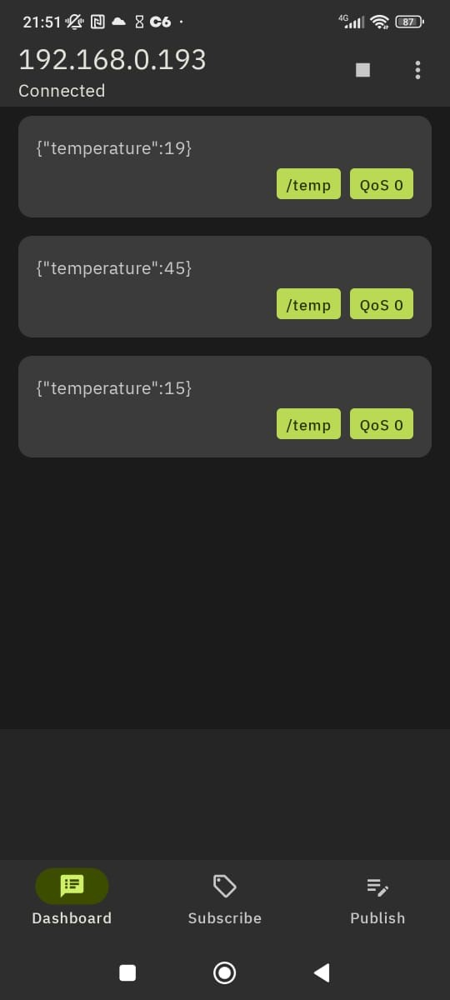
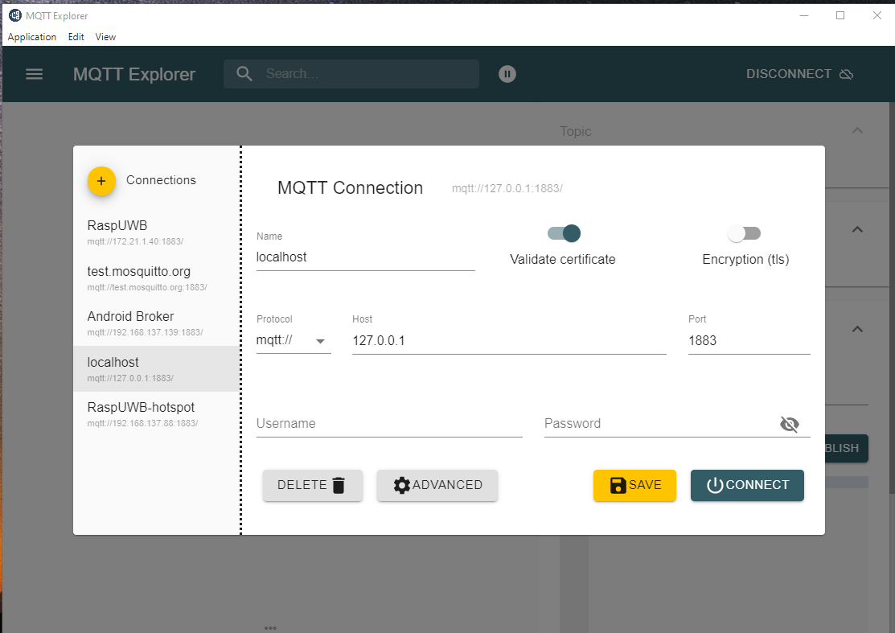
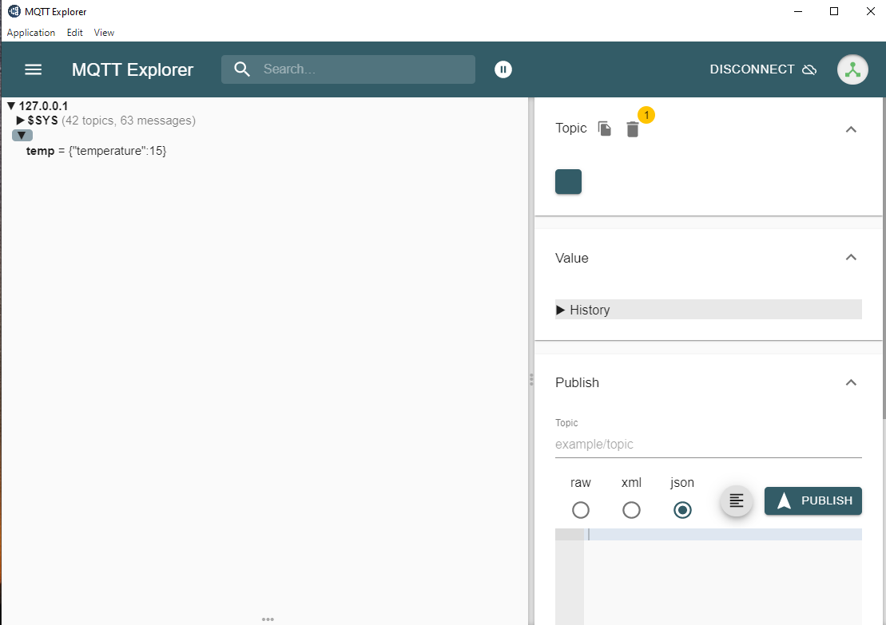
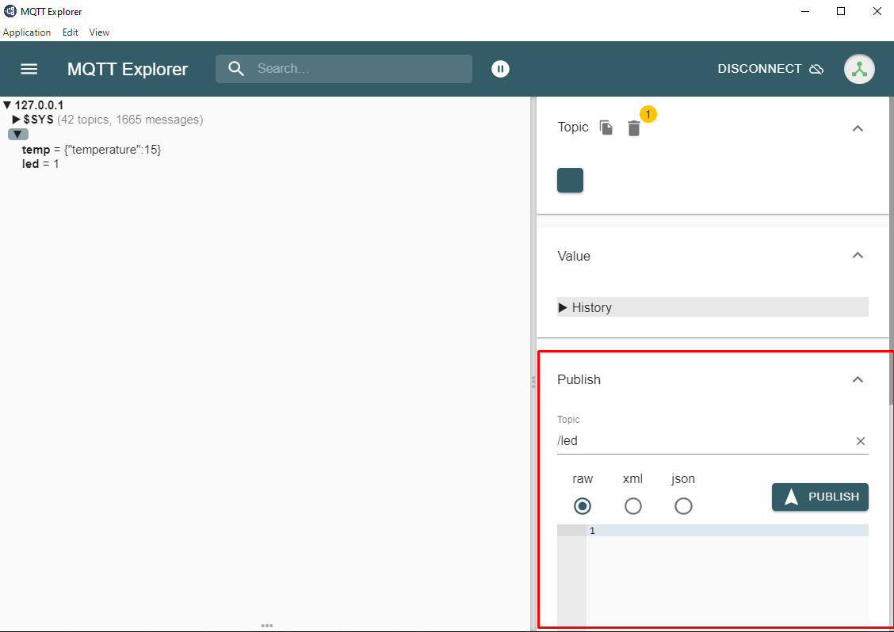

# Lesson 4 - Exercise 1: External communication using MQTT API and a Border Router

## Download following project and open it using the VS code

[mqtt-aula-4-example](/lesson-4/mqtt-aula-4-example/)

1. Add `usb_nrf52840dongle_nrf52840.conf` and `usb_nrf52840dongle_nrf52840.overlay` to the build step

# Connecting to an MQTT broker and publishing a message to a topic
The objective of the exercise is to connect to an MQTT broker and publish a temperature to a topic by pressing the button on the board

## Programming the Nordic board
1. Add the following settings to `prj.conf`
    ```conf
    # TCP for MQTT
    CONFIG_NET_TCP=y
    CONFIG_NET_TCP_TIME_WAIT_DELAY=1000

    # Enable the MQTT Lib
    CONFIG_MQTT_LIB=y
    ```

1. Add MQTT API include
    ```C
    #include <zephyr/net/mqtt.h>
    ```

1. Add the following defines
    ```c
    // MQTT defines
    #define MQTT_CLIENT_ID	"mqtt_client_01"
    #define SERVER_ADDR		"fd01::10d8:4a14:a5ab:e05c"
    #define SERVER_PORT		1883
    #define APP_CONNECT_TIMEOUT_MS	2000
    #define APP_SLEEP_MSECS		500
    #define APP_CONNECT_TRIES	5
    #define MQTT_PUBLISH_TOPIC "/lesson4/<choose your group name>/temp"
    #define MQTT_SUBSCRIBE_TOPIC "/lesson4/<choose your group name>/led"
    #define MQTT_BROKER_PASSWORD NULL
    #define MQTT_BROKER_USERNAME NULL
    ```

1. Change the value of ```#define MQTT_CLIENT_ID``` to avoid duplication on the network

1. Change the value of ```#define SERVER_ADDR``` to the Broker's IPv6 address

    [Link to Broker IP](https://docs.google.com/document/d/1vyUV47gHinF-xTYLZZwq0btTZh-BhY7RQ0jhlOCcDsQ/edit?usp=sharing)

1. Change the value of ``` #define MQTT_PUBLISH_TOPIC``` and ``` #define MQTT_SUBSCRIBE_TOPIC```, choosing a value that uniquely identifies your group/board. For example:

    ```C
    #define MQTT_PUBLISH_TOPIC "/lesson4/<choose your group name>/temp"
    #define MQTT_SUBSCRIBE_TOPIC "/lesson4/<choose your group name>/led"
    ```
1. Add the following functions to start the Broker and the Client
    ```C
    static void broker_init(void)
    {
        struct sockaddr_in6 *broker6 = (struct sockaddr_in6 *)&broker;

        broker6->sin6_family = AF_INET6;
        broker6->sin6_port = htons(SERVER_PORT);
        zsock_inet_pton(AF_INET6, SERVER_ADDR, &broker6->sin6_addr);
        LOG_INF("broker_init IPv6 for address %s %i", SERVER_ADDR, SERVER_PORT);
    }

    static void client_init(struct mqtt_client *client)
    {
        mqtt_client_init(client);

        broker_init();

        /* MQTT client configuration */
        client->broker = &broker;
        client->evt_cb = mqtt_evt_handler;
        client->client_id.utf8 = (uint8_t *)MQTT_CLIENT_ID;
        client->client_id.size = strlen(MQTT_CLIENT_ID);
        client->password = MQTT_BROKER_PASSWORD;
        client->user_name = MQTT_BROKER_USERNAME;
        client->protocol_version = MQTT_VERSION_3_1_1;
        client->transport.type = MQTT_TRANSPORT_NON_SECURE;

        /* MQTT buffers configuration */
        client->rx_buf = rx_buffer;
        client->rx_buf_size = sizeof(rx_buffer);
        client->tx_buf = tx_buffer;
        client->tx_buf_size = sizeof(tx_buffer);
    }
    ```

1. Add the following function to request connection to the Broker
    ```C
    /* In this routine we block until the connected variable is 1 */
    static int try_to_connect(struct mqtt_client *client)
    {
        int rc, i = 0;

        while (i++ < APP_CONNECT_TRIES && !connected) {

            client_init(client);

            rc = mqtt_connect(client);
            if (rc != 0) {
                LOG_INF("mqtt_connect error %d", rc);
                k_sleep(K_MSEC(APP_SLEEP_MSECS));
                continue;
            }

            prepare_fds(client);

            k_msleep(APP_CONNECT_TIMEOUT_MS);
            
            mqtt_input(client);
            

            if (!connected) {
                mqtt_abort(client);
            }
        }

        if (connected) {
            return 0;
        }

        return -EINVAL;
    }
    ```

1. At the end of the `main()` function add a call to the `try_to_connect(...)` function

    ```c
    // Connectiong to a MQTT Broker
	int rc = try_to_connect(&client_ctx);
	if(rc == 0){
		LOG_INF("Connected to the broker");
	}else{
		LOG_INF("Broker connection error: %d", rc);
		return;
	}
    ```

1. Add the following function to publish a temperature
    ```C
    static int publish_temperature()
    {
        char payload[30]; 

        // generating the payload with a random temperature
        snprintk(payload, sizeof(payload), "{\"temperature\":%d}",
            (uint8_t)sys_rand32_get()%50);

        if(connected){
            // publishing a temperature sample to a topic MQTT_PUBLISH_TOPIC with QoS zero.
            return publish(&client_ctx, MQTT_PUBLISH_TOPIC, payload, MQTT_QOS_0_AT_MOST_ONCE);
        } else{
            LOG_INF("publish_temperature the device is not connected");
            return -1;
        }
    }
    ```

1. Call the function to publish a temperature in the button callback function

    ```C
    void button_pressed(const struct device *dev, struct gpio_callback *cb, uint32_t pins)
    {	
        int rc = publish_temperature();
        if(rc == 0){
            LOG_INF("the temperature has been published");
        }else{
            LOG_INF("Error when publishing the temperature: %d", rc);
        }
    }
    ``` 

## Configuring the MQTT client
### Via Android
 1. Download the following APP
 
    [MyMQTT](https://play.google.com/store/apps/details?id=at.tripwire.mqtt.client&hl=en&gl=US)

1. Fill in the broker information and leave the credentials empty
    
    [Link para o IP do Broker](https://docs.google.com/document/d/1vyUV47gHinF-xTYLZZwq0btTZh-BhY7RQ0jhlOCcDsQ/edit?usp=sharing)

2. Subscribe to the topic defined in MQTT_PUBLISH_TOPIC
    <p align="center">
        
    <p>

2. Return to the *Dashboard* to see the publications and press the *publish button* to publish a temperature
    <p align="center">
        
    <p>

### Via Windows
 1. Download the following program
 
    [MQTT Explorer](http://mqtt-explorer.com/)

1. Fill in the broker information and leave the credentials empty
    
    [Link para o IP do Broker](https://docs.google.com/document/d/1vyUV47gHinF-xTYLZZwq0btTZh-BhY7RQ0jhlOCcDsQ/edit?usp=sharing)

    <p align="center">
        
    <p>

2. Press the button on the board that sends a temperature and view the message in Broker Explorer
    <p align="center">
        
    <p>

# Controlling the LED through a MQTT subscription

## Developing the subscription process

 1. Add the following function to handle messages coming from a topic

    ```C
    void process_evt_publish(struct mqtt_client *const client, const struct mqtt_evt *evt){
        const struct mqtt_publish_param *pub = &evt->param.publish;
        uint8_t payload[50];
        uint8_t topic[50];
        
        int len = pub->message.payload.len;
        int bytes_read;

        memcpy(topic, pub->message.topic.topic.utf8, pub->message.topic.topic.size);
        topic[pub->message.topic.topic.size+1] = '\0';
        LOG_INF("MQTT publish received %d, %d bytes",
            evt->result, len);
        LOG_INF("   id: %d, qos: %d",
            pub->message_id,
            pub->message.topic.qos);
        printk("   topico: %s",
            topic);

        /* assuming the message is textual */
        while (len) {
            bytes_read = mqtt_read_publish_payload(
                client, payload,
                len >= (sizeof(payload) - 1) ? (sizeof(payload) - 1) : len);
            if (bytes_read < 0 && bytes_read != -EAGAIN) {
                LOG_ERR("failure to read payload");
                break;
            }

            payload[bytes_read] = '\0';
            printk("   payload: |%s|\n", payload);
            len -= bytes_read;
        }

        //checking for LED commands
        if(strcmp(payload, "1") == 0){
            // Turning on the LED
            printk("Turning on LED1\n");
            gpio_pin_set_dt(&led, 1);
            ledState = 1;
        }else if(strcmp(payload, "0") == 0){
            // Turning off the LED
            printk("Turning off LED1\n");
            gpio_pin_set_dt(&led, 0);
            ledState = 0;
        }else{
            printk("payload should be 1 or 0\n");
        }

        /* for MQTT_QOS_0_AT_MOST_ONCE no acknowledgment needed */
        if (pub->message.topic.qos == MQTT_QOS_1_AT_LEAST_ONCE) {
            struct mqtt_puback_param puback = {
                .message_id = pub->message_id
            };

            mqtt_publish_qos1_ack(client, &puback);
        }
    }
    ```
1. In the `mqtt_evt_handler()` message handling function, in the MQTT_EVT_PUBLISH swtich case, call the previously defined function to handle messages coming from a topic.

    ```C
    // other cases
    case MQTT_EVT_PUBLISH:
		// function to process publish events
		process_evt_publish(client, evt);
		break;
    // other cases
    ```

	

1. Add the following function to subscribe to a topic

    ```C
    static int subscribe(struct mqtt_client *client, char *topic_name)
    {	
        struct mqtt_topic subscribe_topic = {
            .topic = {
                .utf8 = topic_name,
                .size = strlen(topic_name)
            }
        };

        const struct mqtt_subscription_list subscription_list = {
            .list = &subscribe_topic,
            .list_count = 1U,
            .message_id = 1U
        };

        LOG_INF("Subscribing to: %s len %u", topic_name,
            (unsigned int)strlen(topic_name));

        return mqtt_subscribe(client, &subscription_list);
    }
    ```

1. Add the following code snippet to the end of `main()`
    ```C
    void main(void){
        //....othe codes
        
        // subscribing to a topic defined in MQTT_SUBSCRIBE_TOPIC
        if(connected){
            int rc = subscribe(&client_ctx, MQTT_SUBSCRIBE_TOPIC);
            if(rc == 0){
                LOG_INF("Subscription completed successfully");
            }else{
                LOG_INF("Subscription error: %d", rc);
                return;
            }
        }

        // Checking for new messages
        while(1){
            if(connected){
                subscriptions_listener();
            }
            k_msleep(1000);
        }
    }
    ```

## Publishing information to the Broker aiming to control the LED
### Via Android

1. Go to the *publish* tab and send message 0 or 1 to the topic defined in MQTT_SUBSCRIBE_TOPIC
    <p align="center">
        
    <p>

### Via Windows
1. Go to the *publish* tab and send message 0 or 1, checking the *raw* option, to the topic defined in MQTT_SUBSCRIBE_TOPIC
    <p align="center">
        
    <p>
